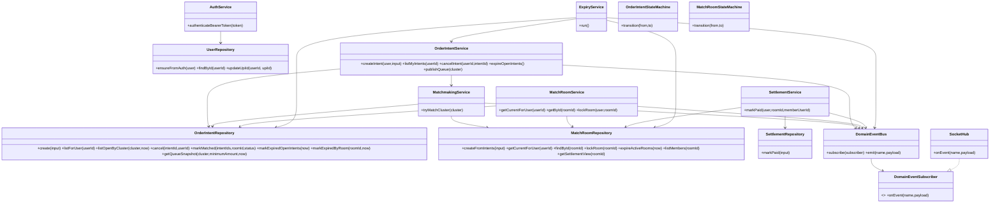

```mermaid
classDiagram
    class AuthService {+authenticateBearerToken(token)}
    class UserRepository {+ensureFromAuth(user) +findById(userId) +updateUpiId(userId, upiId)}

    class OrderIntentService {+createIntent(user,input) +listMyIntents(userId) +cancelIntent(userId,intentId) +expireOpenIntents() +publishQueue(cluster)}
    class MatchmakingService {+tryMatchCluster(cluster)}
    class MatchRoomService {+getCurrentForUser(userId) +getById(roomId) +lockRoom(user,roomId)}
    class SettlementService {+markPaid(user,roomId,memberUserId)}
    class ExpiryService {+run()}

    class OrderIntentRepository {+create(input) +listForUser(userId) +listOpenByCluster(cluster,now) +cancel(intentId,userId) +markMatched(intentIds,roomId,status) +markExpiredOpenIntents(now) +markExpiredByRoom(roomId,now) +getQueueSnapshot(cluster,minimumAmount,now)}
    class MatchRoomRepository {+createFromIntents(input) +getCurrentForUser(userId) +findById(roomId) +lockRoom(roomId) +expireActiveRooms(now) +listMembers(roomId) +getSettlementView(roomId)}
    class SettlementRepository {+markPaid(input)}

    class DomainEventBus {+subscribe(subscriber) +emit(name,payload)}
    class DomainEventSubscriber {<<interface>> +onEvent(name,payload)}
    class SocketHub {+onEvent(name,payload)}

    class OrderIntentStateMachine {+transition(from,to)}
    class MatchRoomStateMachine {+transition(from,to)}

    AuthService --> UserRepository

    OrderIntentService --> OrderIntentRepository
    OrderIntentService --> MatchmakingService
    OrderIntentService --> DomainEventBus

    MatchmakingService --> OrderIntentRepository
    MatchmakingService --> MatchRoomRepository
    MatchmakingService --> DomainEventBus

    MatchRoomService --> MatchRoomRepository
    MatchRoomService --> OrderIntentRepository
    MatchRoomService --> DomainEventBus

    SettlementService --> MatchRoomRepository
    SettlementService --> SettlementRepository
    SettlementService --> DomainEventBus

    ExpiryService --> OrderIntentRepository
    ExpiryService --> MatchRoomRepository
    ExpiryService --> OrderIntentService
    ExpiryService --> DomainEventBus

    DomainEventBus --> DomainEventSubscriber
    SocketHub ..|> DomainEventSubscriber
```
