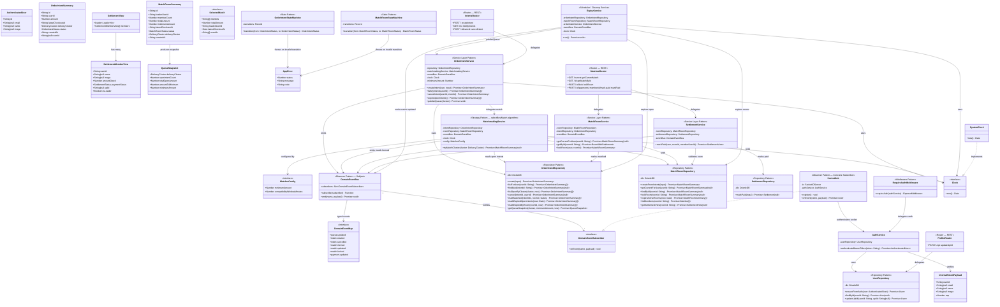

```mermaid
classDiagram
    %% ─────────────────────────────────────────────
    %% FDF — Free Delivery Forever
    %% Class Diagram  (draw.io / Mermaid compatible)
    %% Design Patterns annotated inline
    %% ─────────────────────────────────────────────

    %% ═══════════════ DOMAIN / LIB ═══════════════

    class AuthenticatedUser {
        +String id
        +String|null email
        +String|null name
        +String|null image
    }

    class OrderIntentSummary {
        +String id
        +String userId
        +Number amount
        +String latestCheckoutAt
        +DeliveryCluster deliveryCluster
        +OrderIntentStatus status
        +String createdAt
        +String|null roomId
    }

    class MatchRoomSummary {
        +String id
        +String leaderUserId
        +Number memberCount
        +Number totalAmount
        +Number minimumAmount
        +String latestCheckoutAt
        +MatchRoomStatus status
        +DeliveryCluster deliveryCluster
        +String createdAt
    }

    class SettlementView {
        +leader~LeaderInfo~
        +SettlementMemberView[] members
    }

    class SettlementMemberView {
        +String userId
        +String|null name
        +String|null image
        +Number amountOwed
        +SettlementStatus paymentStatus
        +String|null upiId
        +Boolean isLeader
    }

    class QueueSnapshot {
        +DeliveryCluster deliveryCluster
        +Number openIntentCount
        +Number totalOpenAmount
        +Number amountToMinimum
        +Number minimumAmount
    }

    class DomainEventMap {
        <<interface>>
        +queue.updated
        +intent.created
        +intent.cancelled
        +match.formed
        +match.updated
        +match.locked
        +payment.updated
    }

    class AppError {
        +Number status
        +String message
        +String code
    }

    class InternalTokenPayload {
        +String userId
        +String|null email
        +String|null name
        +String|null image
        +Number exp
    }

    class MatcherConfig {
        <<interface>>
        +Number minimumAmount
        +Number compatibilityWindowMinutes
    }

    class SelectedMatch {
        <<interface>>
        +String[] intentIds
        +Number totalAmount
        +String leaderUserId
        +Date latestCheckoutAt
        +String[] userIds
    }

    %% ═══════════════ STATE MACHINES (State Pattern) ═══════════════

    class OrderIntentStateMachine {
        <<State Pattern>>
        -transitions: Record
        +transition(from: OrderIntentStatus, to: OrderIntentStatus) OrderIntentStatus
    }

    class MatchRoomStateMachine {
        <<State Pattern>>
        -transitions: Record
        +transition(from: MatchRoomStatus, to: MatchRoomStatus) MatchRoomStatus
    }

    %% ═══════════════ EVENT BUS (Observer Pattern) ═══════════════

    class DomainEventSubscriber {
        <<interface>>
        <<Observer Pattern>>
        +onEvent(name, payload) void
    }

    class DomainEventBus {
        <<Observer Pattern — Subject>>
        -subscribers: Set~DomainEventSubscriber~
        +subscribe(subscriber) Function
        +emit(name, payload) Promise~void~
    }

    %% ═══════════════ AUTH ═══════════════

    class AuthService {
        -userRepository: UserRepository
        +authenticateBearerToken(token: String) Promise~AuthenticatedUser~
    }

    %% ═══════════════ REPOSITORIES (Repository Pattern) ═══════════════

    class UserRepository {
        <<Repository Pattern>>
        -db: DrizzleDB
        +ensureFromAuth(user: AuthenticatedUser) Promise~User~
        +findById(userId: String) Promise~User|null~
        +updateUpiId(userId: String, upiId: String|null) Promise~User~
    }

    class OrderIntentRepository {
        <<Repository Pattern>>
        -db: DrizzleDB
        +create(input) Promise~OrderIntentSummary~
        +listForUser(userId: String) Promise~OrderIntentSummary[]~
        +findById(intentId: String) Promise~OrderIntentSummary|null~
        +listOpenByCluster(cluster, now) Promise~OrderIntentSummary[]~
        +cancel(intentId, userId) Promise~OrderIntentSummary|null~
        +markMatched(intentIds, roomId, status) Promise~OrderIntentSummary[]~
        +markExpiredOpenIntents(now: Date) Promise~OrderIntentSummary[]~
        +markExpiredByRoom(roomId, now) Promise~OrderIntentSummary[]~
        +getQueueSnapshot(cluster, minimumAmount, now) Promise~QueueSnapshot~
    }

    class MatchRoomRepository {
        <<Repository Pattern>>
        -db: DrizzleDB
        +createFromIntents(input) Promise~MatchRoomSummary~
        +getCurrentForUser(userId: String) Promise~MatchRoomSummary|null~
        +findById(roomId: String) Promise~MatchRoomSummary|null~
        +lockRoom(roomId: String) Promise~MatchRoomSummary|null~
        +expireActiveRooms(now: Date) Promise~MatchRoomSummary[]~
        +listMembers(roomId: String) Promise~Member[]~
        +getSettlementView(roomId: String) Promise~SettlementView|null~
    }

    class SettlementRepository {
        <<Repository Pattern>>
        -db: DrizzleDB
        +markPaid(input) Promise~Settlement|null~
    }

    %% ═══════════════ SERVICES (Service Layer Pattern) ═══════════════

    class OrderIntentService {
        <<Service Layer Pattern>>
        -repository: OrderIntentRepository
        -matchmakingService: MatchmakingService
        -eventBus: DomainEventBus
        -clock: Clock
        -minimumAmount: Number
        +createIntent(user, input) Promise~OrderIntentSummary~
        +listMyIntents(userId) Promise~OrderIntentSummary[]~
        +cancelIntent(userId, intentId) Promise~OrderIntentSummary~
        +expireOpenIntents() Promise~OrderIntentSummary[]~
        +publishQueue(cluster) Promise~void~
    }

    class MatchmakingService {
        <<Strategy Pattern — selectBestMatch algorithm>>
        -intentRepository: OrderIntentRepository
        -roomRepository: MatchRoomRepository
        -eventBus: DomainEventBus
        -clock: Clock
        -config: MatcherConfig
        +tryMatchCluster(cluster: DeliveryCluster) Promise~MatchRoomSummary|null~
    }

    class MatchRoomService {
        <<Service Layer Pattern>>
        -roomRepository: MatchRoomRepository
        -intentRepository: OrderIntentRepository
        -eventBus: DomainEventBus
        +getCurrentForUser(userId: String) Promise~MatchRoomSummary|null~
        +getById(roomId: String) Promise~RoomWithSettlement~
        +lockRoom(user, roomId) Promise~MatchRoomSummary~
    }

    class SettlementService {
        <<Service Layer Pattern>>
        -roomRepository: MatchRoomRepository
        -settlementRepository: SettlementRepository
        -eventBus: DomainEventBus
        +markPaid(user, roomId, memberUserId) Promise~SettlementView~
    }

    class ExpiryService {
        <<Scheduler / Cleanup Service>>
        -orderIntentRepository: OrderIntentRepository
        -matchRoomRepository: MatchRoomRepository
        -orderIntentService: OrderIntentService
        -eventBus: DomainEventBus
        -clock: Clock
        +run() Promise~void~
    }

    %% ═══════════════ REALTIME (Observer Pattern — SocketHub) ═══════════════

    class SocketHub {
        <<Observer Pattern — Concrete Subscriber>>
        -io: SocketIOServer
        -authService: AuthService
        +register() void
        +onEvent(name, payload) Promise~void~
    }

    %% ═══════════════ MIDDLEWARE ═══════════════

    class RequireAuthMiddleware {
        <<Middleware Pattern>>
        +requireAuth(authService) ExpressMiddleware
    }

    %% ═══════════════ ROUTES ═══════════════

    class IntentsRouter {
        <<Router — REST>>
        +POST / createIntent
        +GET /me listMyIntents
        +POST /:id/cancel cancelIntent
    }

    class MatchesRouter {
        <<Router — REST>>
        +GET /current getCurrentMatch
        +GET /:id getMatchById
        +POST /:id/lock lockRoom
        +POST /:id/payments/:memberId/mark-paid markPaid
    }

    class ProfileRouter {
        <<Router — REST>>
        +PATCH /upi updateUpiId
    }

    %% ═══════════════ CLOCK (Interface Segregation) ═══════════════

    class Clock {
        <<interface>>
        +now() Date
    }

    class SystemClock {
        +now() Date
    }

    %% ─────────────────────────────────────────────
    %% RELATIONSHIPS
    %% ─────────────────────────────────────────────

    DomainEventBus "1" --> "*" DomainEventSubscriber : notifies
    SocketHub ..|> DomainEventSubscriber : implements
    DomainEventBus --> DomainEventMap : typed events

    AuthService --> UserRepository : uses
    AuthService --> InternalTokenPayload : verifies

    OrderIntentService --> OrderIntentRepository : uses
    OrderIntentService --> MatchmakingService : delegates match
    OrderIntentService --> DomainEventBus : emits
    OrderIntentService --> Clock : uses

    MatchmakingService --> OrderIntentRepository : reads open intents
    MatchmakingService --> MatchRoomRepository : creates rooms
    MatchmakingService --> DomainEventBus : emits match.formed
    MatchmakingService --> Clock : uses
    MatchmakingService --> MatcherConfig : configured by

    MatchRoomService --> MatchRoomRepository : uses
    MatchRoomService --> OrderIntentRepository : marks matched
    MatchRoomService --> DomainEventBus : emits match.locked

    SettlementService --> MatchRoomRepository : validates room
    SettlementService --> SettlementRepository : marks paid
    SettlementService --> DomainEventBus : emits payment.updated

    ExpiryService --> OrderIntentRepository : expires open
    ExpiryService --> MatchRoomRepository : expires rooms
    ExpiryService --> OrderIntentService : publishQueue
    ExpiryService --> DomainEventBus : emits match.updated
    ExpiryService --> Clock : uses

    SocketHub --> AuthService : authenticates socket

    RequireAuthMiddleware --> AuthService : delegates auth

    IntentsRouter --> OrderIntentService : delegates
    MatchesRouter --> MatchRoomService : delegates
    MatchesRouter --> SettlementService : delegates
    ProfileRouter --> UserRepository : delegates

    SystemClock ..|> Clock : implements

    OrderIntentStateMachine --> AppError : throws on invalid transition
    MatchRoomStateMachine --> AppError : throws on invalid transition

    SettlementView --> SettlementMemberView : has many
    MatchRoomSummary --> QueueSnapshot : produces snapshot
```
