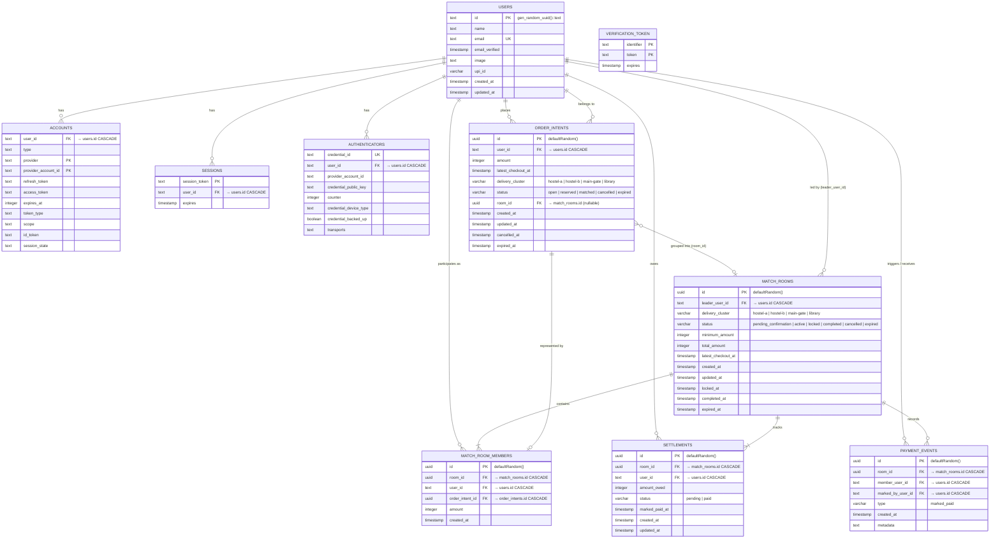

```mermaid
erDiagram
    %% ─────────────────────────────────────────────────────────────
    %% FDF — Free Delivery Forever
    %% ER Diagram  (draw.io / Mermaid compatible)
    %% ─────────────────────────────────────────────────────────────

    %% ═══════════ AUTH SCHEMA ═══════════

    USERS {
        text id PK "gen_random_uuid()::text"
        text name
        text email UK
        timestamp email_verified
        text image
        varchar upi_id
        timestamp created_at
        timestamp updated_at
    }

    ACCOUNTS {
        text user_id FK "→ users.id CASCADE"
        text type
        text provider PK
        text provider_account_id PK
        text refresh_token
        text access_token
        integer expires_at
        text token_type
        text scope
        text id_token
        text session_state
    }

    SESSIONS {
        text session_token PK
        text user_id FK "→ users.id CASCADE"
        timestamp expires
    }

    VERIFICATION_TOKEN {
        text identifier PK
        text token PK
        timestamp expires
    }

    AUTHENTICATORS {
        text credential_id UK
        text user_id FK "→ users.id CASCADE"
        text provider_account_id
        text credential_public_key
        integer counter
        text credential_device_type
        boolean credential_backed_up
        text transports
    }

    %% ═══════════ APP SCHEMA ═══════════

    ORDER_INTENTS {
        uuid id PK "defaultRandom()"
        text user_id FK "→ users.id CASCADE"
        integer amount
        timestamp latest_checkout_at
        varchar delivery_cluster "hostel-a | hostel-b | main-gate | library"
        varchar status "open | reserved | matched | cancelled | expired"
        uuid room_id FK "→ match_rooms.id (nullable)"
        timestamp created_at
        timestamp updated_at
        timestamp cancelled_at
        timestamp expired_at
    }

    MATCH_ROOMS {
        uuid id PK "defaultRandom()"
        text leader_user_id FK "→ users.id CASCADE"
        varchar delivery_cluster "hostel-a | hostel-b | main-gate | library"
        varchar status "pending_confirmation | active | locked | completed | cancelled | expired"
        integer minimum_amount
        integer total_amount
        timestamp latest_checkout_at
        timestamp created_at
        timestamp updated_at
        timestamp locked_at
        timestamp completed_at
        timestamp expired_at
    }

    MATCH_ROOM_MEMBERS {
        uuid id PK "defaultRandom()"
        uuid room_id FK "→ match_rooms.id CASCADE"
        text user_id FK "→ users.id CASCADE"
        uuid order_intent_id FK "→ order_intents.id CASCADE"
        integer amount
        timestamp created_at
    }

    SETTLEMENTS {
        uuid id PK "defaultRandom()"
        uuid room_id FK "→ match_rooms.id CASCADE"
        text user_id FK "→ users.id CASCADE"
        integer amount_owed
        varchar status "pending | paid"
        timestamp marked_paid_at
        timestamp created_at
        timestamp updated_at
    }

    PAYMENT_EVENTS {
        uuid id PK "defaultRandom()"
        uuid room_id FK "→ match_rooms.id CASCADE"
        text member_user_id FK "→ users.id CASCADE"
        text marked_by_user_id FK "→ users.id CASCADE"
        varchar type "marked_paid"
        timestamp created_at
        text metadata
    }

    %% ─────────────────────────────────────────────────────────────
    %% RELATIONSHIPS
    %% ─────────────────────────────────────────────────────────────

    USERS ||--o{ ACCOUNTS : "has"
    USERS ||--o{ SESSIONS : "has"
    USERS ||--o{ AUTHENTICATORS : "has"

    USERS ||--o{ ORDER_INTENTS : "places"
    USERS ||--o{ MATCH_ROOM_MEMBERS : "participates as"
    USERS ||--o{ SETTLEMENTS : "owes"
    USERS ||--o{ PAYMENT_EVENTS : "triggers / receives"

    MATCH_ROOMS ||--|{ MATCH_ROOM_MEMBERS : "contains"
    MATCH_ROOMS ||--|{ SETTLEMENTS : "tracks"
    MATCH_ROOMS ||--o{ PAYMENT_EVENTS : "records"
    MATCH_ROOMS }o--|| USERS : "led by (leader_user_id)"

    ORDER_INTENTS }o--|| USERS : "belongs to"
    ORDER_INTENTS }o--o| MATCH_ROOMS : "grouped into (room_id)"
    ORDER_INTENTS ||--o| MATCH_ROOM_MEMBERS : "represented by"
```
