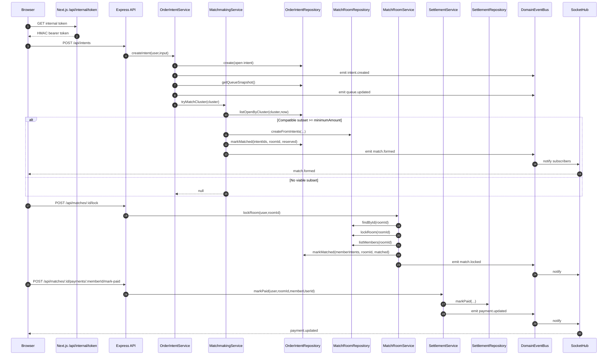

```mermaid
sequenceDiagram
    autonumber
    participant Browser
    participant TokenRoute as Next.js /api/internal/token
    participant API as Express API
    participant OIS as OrderIntentService
    participant MMS as MatchmakingService
    participant OIR as OrderIntentRepository
    participant MRR as MatchRoomRepository
    participant MRS as MatchRoomService
    participant SS as SettlementService
    participant SR as SettlementRepository
    participant Bus as DomainEventBus
    participant Socket as SocketHub

    Browser->>TokenRoute: GET internal token
    TokenRoute-->>Browser: HMAC bearer token

    Browser->>API: POST /api/intents
    API->>OIS: createIntent(user,input)
    OIS->>OIR: create(open intent)
    OIS->>Bus: emit intent.created
    OIS->>OIR: getQueueSnapshot()
    OIS->>Bus: emit queue.updated
    OIS->>MMS: tryMatchCluster(cluster)
    MMS->>OIR: listOpenByCluster(cluster,now)

    alt Compatible subset >= minimumAmount
      MMS->>MRR: createFromIntents(...)
      MMS->>OIR: markMatched(intentIds, roomId, reserved)
      MMS->>Bus: emit match.formed
      Bus->>Socket: notify subscribers
      Socket-->>Browser: match.formed
    else No viable subset
      MMS-->>OIS: null
    end

    Browser->>API: POST /api/matches/:id/lock
    API->>MRS: lockRoom(user,roomId)
    MRS->>MRR: findById(roomId)
    MRS->>MRR: lockRoom(roomId)
    MRS->>MRR: listMembers(roomId)
    MRS->>OIR: markMatched(memberIntents, roomId, matched)
    MRS->>Bus: emit match.locked
    Bus->>Socket: notify

    Browser->>API: POST /api/matches/:id/payments/:memberId/mark-paid
    API->>SS: markPaid(user,roomId,memberUserId)
    SS->>SR: markPaid(...)
    SS->>Bus: emit payment.updated
    Bus->>Socket: notify
    Socket-->>Browser: payment.updated
```
