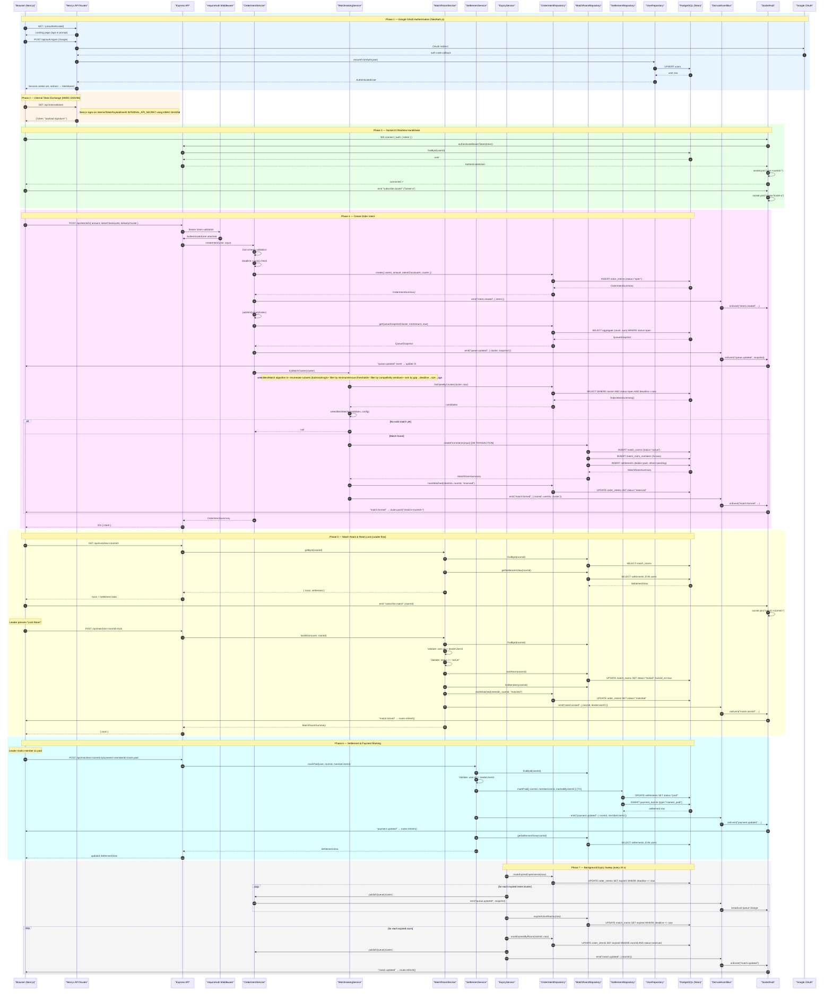

```mermaid
sequenceDiagram
    %% ─────────────────────────────────────────────────────────────────────
    %% FDF — Free Delivery Forever
    %% Sequence Diagram: Complete User Flow
    %% (draw.io / Mermaid compatible)
    %% ─────────────────────────────────────────────────────────────────────

    autonumber

    participant Browser as "Browser (Next.js)"
    participant NextAPI as "Next.js API Routes"
    participant ExpressAPI as "Express API"
    participant AuthMW as "requireAuth Middleware"
    participant OIS as "OrderIntentService"
    participant MMS as "MatchmakingService"
    participant MRS as "MatchRoomService"
    participant SS as "SettlementService"
    participant ES as "ExpiryService"
    participant OIR as "OrderIntentRepository"
    participant MRR as "MatchRoomRepository"
    participant SR as "SettlementRepository"
    participant UR as "UserRepository"
    participant DB as "PostgreSQL (Neon)"
    participant EventBus as "DomainEventBus"
    participant SocketHub as "SocketHub"
    participant GoogleOAuth as "Google OAuth"

    %% ─── PHASE 1: Authentication ──────────────────────────────────────────
    rect rgb(230, 245, 255)
        Note over Browser, GoogleOAuth: Phase 1 — Google OAuth Authentication (NextAuth.js)
        Browser->>NextAPI: GET / (unauthenticated)
        NextAPI-->>Browser: Landing page (sign-in prompt)
        Browser->>NextAPI: POST /api/auth/signin (Google)
        NextAPI->>GoogleOAuth: OAuth redirect
        GoogleOAuth-->>NextAPI: auth code callback
        NextAPI->>UR: ensureFromAuth(user)
        UR->>DB: UPSERT users
        DB-->>UR: user row
        UR-->>NextAPI: AuthenticatedUser
        NextAPI-->>Browser: Session cookie set, redirect → /dashboard
    end

    %% ─── PHASE 2: Token Exchange ──────────────────────────────────────────
    rect rgb(255, 245, 230)
        Note over Browser, NextAPI: Phase 2 — Internal Token Exchange (HMAC-SHA256)
        Browser->>NextAPI: GET /api/internal/token
        Note right of NextAPI: Next.js signs an InternalTokenPayload\nwith INTERNAL_API_SECRET using HMAC-SHA256
        NextAPI-->>Browser: { token: "payload.signature" }
    end

    %% ─── PHASE 3: Socket.IO Connection ───────────────────────────────────
    rect rgb(230, 255, 230)
        Note over Browser, SocketHub: Phase 3 — Socket.IO Realtime Handshake
        Browser->>SocketHub: WS connect { auth: { token } }
        SocketHub->>ExpressAPI: authenticateBearerToken(token)
        ExpressAPI->>DB: findById(userId)
        DB-->>ExpressAPI: user
        ExpressAPI-->>SocketHub: AuthenticatedUser
        SocketHub->>SocketHub: socket.join("user:<userId>")
        SocketHub-->>Browser: connected ✓
        Browser->>SocketHub: emit "subscribe.cluster" ("hostel-a")
        SocketHub->>SocketHub: socket.join("cluster:hostel-a")
    end

    %% ─── PHASE 4: Create Order Intent ────────────────────────────────────
    rect rgb(255, 230, 255)
        Note over Browser, DB: Phase 4 — Create Order Intent
        Browser->>ExpressAPI: POST /api/intents\n{ amount, latestCheckoutAt, deliveryCluster }
        ExpressAPI->>AuthMW: Bearer token validation
        AuthMW->>ExpressAPI: AuthenticatedUser attached
        ExpressAPI->>OIS: createIntent(user, input)
        OIS->>OIS: Zod schema validation
        OIS->>OIS: deadline > now() check
        OIS->>OIR: create({ userId, amount, latestCheckoutAt, cluster })
        OIR->>DB: INSERT order_intents (status="open")
        DB-->>OIR: OrderIntentSummary
        OIR-->>OIS: OrderIntentSummary
        OIS->>EventBus: emit("intent.created", { intent })
        EventBus->>SocketHub: onEvent("intent.created", ...)
        OIS->>OIS: publishQueue(cluster)
        OIS->>OIR: getQueueSnapshot(cluster, minAmount, now)
        OIR->>DB: SELECT aggregate (count, sum) WHERE status=open
        DB-->>OIR: QueueSnapshot
        OIR-->>OIS: QueueSnapshot
        OIS->>EventBus: emit("queue.updated", { cluster, snapshot })
        EventBus->>SocketHub: onEvent("queue.updated", snapshot)
        SocketHub->>Browser: "queue.updated" event → update UI
        OIS->>MMS: tryMatchCluster(cluster)
        Note over MMS: selectBestMatch algorithm:\n- enumerate subsets (backtracking)\n- filter by minimumAmount threshold\n- filter by compatibility window\n- rank by gap→deadline→size→age
        MMS->>OIR: listOpenByCluster(cluster, now)
        OIR->>DB: SELECT WHERE cluster AND status=open AND deadline > now
        DB-->>OIR: OrderIntentSummary[]
        OIR-->>MMS: candidates
        MMS->>MMS: selectBestMatch(candidates, config)
        alt No valid match yet
            MMS-->>OIS: null
        else Match found
            MMS->>MRR: createFromIntents(input) [DB TRANSACTION]
            MRR->>DB: INSERT match_rooms (status="active")
            MRR->>DB: INSERT match_room_members (N rows)
            MRR->>DB: INSERT settlements (leader=paid, others=pending)
            DB-->>MRR: MatchRoomSummary
            MRR-->>MMS: MatchRoomSummary
            MMS->>OIR: markMatched(intentIds, roomId, "reserved")
            OIR->>DB: UPDATE order_intents SET status="reserved"
            MMS->>EventBus: emit("match.formed", { roomId, userIds, cluster })
            EventBus->>SocketHub: onEvent("match.formed", ...)
            SocketHub->>Browser: "match.formed" → router.push("/match/<roomId>")
        end
        OIS-->>ExpressAPI: OrderIntentSummary
        ExpressAPI-->>Browser: 201 { intent }
    end

    %% ─── PHASE 5: Match Room ─────────────────────────────────────────────
    rect rgb(255, 255, 220)
        Note over Browser, DB: Phase 5 — Match Room & Room Lock (Leader flow)
        Browser->>ExpressAPI: GET /api/matches/<roomId>
        ExpressAPI->>MRS: getById(roomId)
        MRS->>MRR: findById(roomId)
        MRR->>DB: SELECT match_rooms
        MRS->>MRR: getSettlementView(roomId)
        MRR->>DB: SELECT settlements JOIN users
        DB-->>MRR: SettlementView
        MRS-->>ExpressAPI: { room, settlement }
        ExpressAPI-->>Browser: room + settlement data
        Browser->>SocketHub: emit "subscribe.match" (roomId)
        SocketHub->>SocketHub: socket.join("match:<roomId>")
        Note over Browser: Leader presses "Lock Room"
        Browser->>ExpressAPI: POST /api/matches/<roomId>/lock
        ExpressAPI->>MRS: lockRoom(user, roomId)
        MRS->>MRR: findById(roomId)
        MRS->>MRS: Validate: user.id == leaderUserId
        MRS->>MRS: Validate: status == "active"
        MRS->>MRR: lockRoom(roomId)
        MRR->>DB: UPDATE match_rooms SET status="locked", locked_at=now
        MRS->>MRR: listMembers(roomId)
        MRS->>OIR: markMatched(intentIds, roomId, "matched")
        OIR->>DB: UPDATE order_intents SET status="matched"
        MRS->>EventBus: emit("match.locked", { roomId, leaderUserId })
        EventBus->>SocketHub: onEvent("match.locked", ...)
        SocketHub->>Browser: "match.locked" → router.refresh()
        MRS-->>ExpressAPI: MatchRoomSummary
        ExpressAPI-->>Browser: { room }
    end

    %% ─── PHASE 6: Payment Settlement ─────────────────────────────────────
    rect rgb(220, 255, 255)
        Note over Browser, DB: Phase 6 — Settlement & Payment Marking
        Note over Browser: Leader marks member as paid
        Browser->>ExpressAPI: POST /api/matches/<roomId>/payments/<memberId>/mark-paid
        ExpressAPI->>SS: markPaid(user, roomId, memberUserId)
        SS->>MRR: findById(roomId)
        SS->>SS: Validate: user.id == leaderUserId
        SS->>SR: markPaid({ roomId, memberUserId, markedByUserId }) [TX]
        SR->>DB: UPDATE settlements SET status="paid"
        SR->>DB: INSERT payment_events (type="marked_paid")
        DB-->>SR: settlement row
        SS->>EventBus: emit("payment.updated", { roomId, memberUserId })
        EventBus->>SocketHub: onEvent("payment.updated", ...)
        SocketHub->>Browser: "payment.updated" → router.refresh()
        SS->>MRR: getSettlementView(roomId)
        MRR->>DB: SELECT settlements JOIN users
        SS-->>ExpressAPI: SettlementView
        ExpressAPI-->>Browser: updated SettlementView
    end

    %% ─── PHASE 7: Background Expiry Sweep ───────────────────────────────
    rect rgb(245, 245, 245)
        Note over ES, DB: Phase 7 — Background Expiry Sweep (every 30 s)
        ES->>OIR: markExpiredOpenIntents(now)
        OIR->>DB: UPDATE order_intents SET expired WHERE deadline <= now
        loop for each expired intent cluster
            ES->>OIS: publishQueue(cluster)
            OIS->>EventBus: emit("queue.updated", snapshot)
            EventBus->>SocketHub: broadcast queue change
        end
        ES->>MRR: expireActiveRooms(now)
        MRR->>DB: UPDATE match_rooms SET expired WHERE deadline <= now
        loop for each expired room
            ES->>OIR: markExpiredByRoom(roomId, now)
            OIR->>DB: UPDATE order_intents SET expired WHERE roomId AND status=reserved
            ES->>OIS: publishQueue(cluster)
            ES->>EventBus: emit("match.updated", { roomId })
            EventBus->>SocketHub: onEvent("match.updated")
            SocketHub->>Browser: "match.updated" → router.refresh()
        end
    end
```
