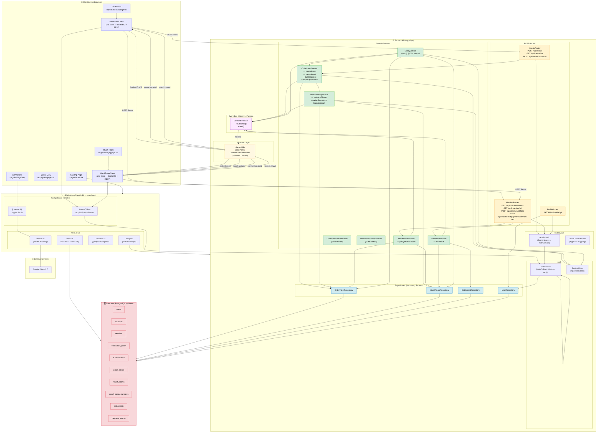

```mermaid
graph TB
    %% ─────────────────────────────────────────────────────────────────────
    %% FDF — Free Delivery Forever
    %% UML Component / Architecture Diagram (draw.io / Mermaid compatible)
    %% ─────────────────────────────────────────────────────────────────────

    subgraph CLIENT["🌐 Client Layer (Browser)"]
        direction TB
        B_HOME["Landing Page\n/pages/index.tsx"]
        B_DASH["Dashboard\n/app/dashboard/page.tsx"]
        B_QUEUE["Queue View\n/app/queue/page.tsx"]
        B_MATCH["Match Room\n/app/match/[id]/page.tsx"]
        B_DC["DashboardClient\n(use client — Socket.IO + REST)"]
        B_MRC["MatchRoomClient\n(use client — Socket.IO + REST)"]
        B_AUTH["AuthActions\n(SignIn / SignOut)"]
    end

    subgraph WEB["📦 Web App (Next.js 14 — apps/web)"]
        direction TB
        subgraph NEXTROUTES["Next.js Route Handlers"]
            N_AUTH["[...nextauth]\n/app/api/auth"]
            N_TOKEN["InternalToken\n/app/api/internal/token"]
        end
        subgraph NEXTLIB["Next.js Lib"]
            NL_AUTH["lib/auth.ts\n(NextAuth config)"]
            NL_API["lib/api.ts\n(apiFetch helper)"]
            NL_QUEUE["lib/queue.ts\n(getQueueSnapshot)"]
            NL_DB["lib/db.ts\n(Drizzle — shared DB)"]
        end
    end

    subgraph API["⚙️ Express API (apps/api)"]
        direction TB

        subgraph ROUTES["REST Routes"]
            R_INTENTS["IntentsRouter\nPOST /api/intents\nGET  /api/intents/me\nPOST /api/intents/:id/cancel"]
            R_MATCHES["MatchesRouter\nGET  /api/matches/current\nGET  /api/matches/:id\nPOST /api/matches/:id/lock\nPOST /api/matches/:id/payments/:m/mark-paid"]
            R_PROFILE["ProfileRouter\nPATCH /api/profile/upi"]
        end

        subgraph MIDDLEWARE["Middleware"]
            MW_AUTH["requireAuth\n(Bearer token → AuthService)"]
            MW_ERR["Global Error Handler\n(AppError mapping)"]
        end

        subgraph SERVICES["Domain Services"]
            SVC_OIS["OrderIntentService\n— createIntent\n— cancelIntent\n— publishQueue\n— expireOpenIntents"]
            SVC_MMS["MatchmakingService\n— tryMatchCluster\n— selectBestMatch (backtracking)"]
            SVC_MRS["MatchRoomService\n— getById / lockRoom"]
            SVC_SS["SettlementService\n— markPaid"]
            SVC_ES["ExpiryService\n— run() @ 30s interval"]
            SVC_SM1["OrderIntentStateMachine\n(State Pattern)"]
            SVC_SM2["MatchRoomStateMachine\n(State Pattern)"]
        end

        subgraph EVENTBUS["Event Bus (Observer Pattern)"]
            EB["DomainEventBus\n+ subscribe()\n+ emit()"]
        end

        subgraph REALTIME["Realtime Layer"]
            SH["SocketHub\nimplements DomainEventSubscriber\n(Socket.IO server)"]
        end

        subgraph REPOS["Repositories (Repository Pattern)"]
            RP_OI["OrderIntentRepository"]
            RP_MR["MatchRoomRepository"]
            RP_SET["SettlementRepository"]
            RP_USR["UserRepository"]
        end

        subgraph AUTH_SVC["Auth"]
            AS["AuthService\n(HMAC-SHA256 token verify)"]
            CLK["SystemClock\nimplements Clock"]
        end
    end

    subgraph DB["🗄️ Database (PostgreSQL — Neon)"]
        direction LR
        TBL_USERS["users"]
        TBL_ACC["accounts"]
        TBL_SES["sessions"]
        TBL_VT["verification_token"]
        TBL_AUT["authenticators"]
        TBL_OI["order_intents"]
        TBL_MR["match_rooms"]
        TBL_MRM["match_room_members"]
        TBL_SET["settlements"]
        TBL_PE["payment_events"]
    end

    subgraph EXTERNAL["🔗 External Services"]
        GOOGLE["Google OAuth 2.0"]
    end

    %% ─────────────────────────────────────────────────────────────────────
    %% CONNECTIONS
    %% ─────────────────────────────────────────────────────────────────────

    %% Client → Web
    B_HOME --> WEB
    B_DASH --> B_DC
    B_MATCH --> B_MRC
    B_DC --> N_TOKEN
    B_MRC --> N_TOKEN
    B_AUTH --> N_AUTH

    %% Web → External (OAuth)
    N_AUTH --> NL_AUTH
    NL_AUTH --> GOOGLE

    %% Web → API (server-side fetches)
    NL_API --> API
    N_TOKEN --> AS
    NL_DB --> DB

    %% Browser → Express (REST+Socket)
    B_DC -->|"REST Bearer"| R_INTENTS
    B_DC -->|"REST Bearer"| R_MATCHES
    B_MRC -->|"REST Bearer"| R_MATCHES
    B_DC -->|"Socket.IO WS"| SH
    B_MRC -->|"Socket.IO WS"| SH

    %% Middleware
    R_INTENTS --> MW_AUTH
    R_MATCHES --> MW_AUTH
    R_PROFILE --> MW_AUTH
    MW_AUTH --> AS

    %% Routes → Services
    R_INTENTS --> SVC_OIS
    R_MATCHES --> SVC_MRS
    R_MATCHES --> SVC_SS
    R_PROFILE --> RP_USR

    %% Services → Services
    SVC_OIS --> SVC_MMS
    SVC_OIS --> CLK
    SVC_MMS --> CLK
    SVC_ES --> SVC_OIS
    SVC_ES --> CLK

    %% Services → Repos
    SVC_OIS --> RP_OI
    SVC_MMS --> RP_OI
    SVC_MMS --> RP_MR
    SVC_MRS --> RP_MR
    SVC_MRS --> RP_OI
    SVC_SS --> RP_MR
    SVC_SS --> RP_SET
    SVC_ES --> RP_OI
    SVC_ES --> RP_MR
    AS --> RP_USR

    %% Services → EventBus (Observer publish)
    SVC_OIS --> EB
    SVC_MMS --> EB
    SVC_MRS --> EB
    SVC_SS --> EB
    SVC_ES --> EB

    %% EventBus → SocketHub (Observer subscribe)
    EB -->|"notifies"| SH

    %% SocketHub → Browser (push events)
    SH -->|"queue.updated"| B_DC
    SH -->|"match.formed"| B_DC
    SH -->|"match.locked"| B_MRC
    SH -->|"match.updated"| B_MRC
    SH -->|"payment.updated"| B_MRC

    %% Repos → DB
    RP_OI --> DB
    RP_MR --> DB
    RP_SET --> DB
    RP_USR --> DB

    %% Auth → Token
    AS --> AS

    %% Styling
    classDef service fill:#d4edda,stroke:#28a745,color:#000
    classDef repo fill:#d1ecf1,stroke:#0c7ed6,color:#000
    classDef route fill:#fff3cd,stroke:#f0ad4e,color:#000
    classDef db fill:#f8d7da,stroke:#dc3545,color:#000
    classDef client fill:#e8e8ff,stroke:#6c6cff,color:#000
    classDef bus fill:#fce8ff,stroke:#9c27b0,color:#000
    classDef rt fill:#fff8e1,stroke:#ff9800,color:#000

    class SVC_OIS,SVC_MMS,SVC_MRS,SVC_SS,SVC_ES,SVC_SM1,SVC_SM2 service
    class RP_OI,RP_MR,RP_SET,RP_USR repo
    class R_INTENTS,R_MATCHES,R_PROFILE route
    class DB,TBL_USERS,TBL_ACC,TBL_SES,TBL_VT,TBL_AUT,TBL_OI,TBL_MR,TBL_MRM,TBL_SET,TBL_PE db
    class B_HOME,B_DASH,B_QUEUE,B_MATCH,B_DC,B_MRC,B_AUTH client
    class EB bus
    class SH rt
```
